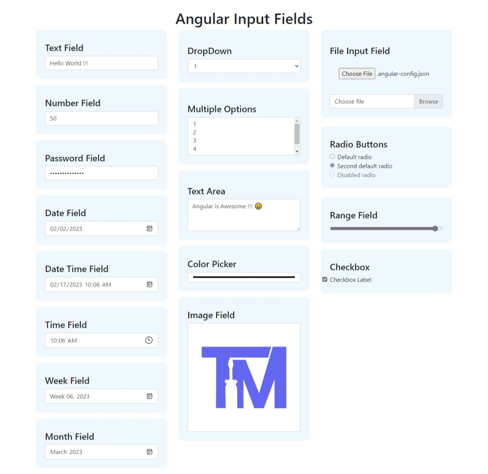

# Angular Input Fields

An Angular Project to check all the different input fields available


## Installation and Running

Install with npm

    Download this repository and then run the following commands

```bash
  npm install
```
Run Angular Server
```bash
  ng serve
```
Open Browser
    http://localhost:4200/

## Available Input Fields

- Text Fields
- Number Fields
- Password Fields
- Date Fields
- Date Time Fields
- Time Fields
- Week Fields
- Month Fields
- DropDown Fields
- Multiple Options Fields
- Text Area Fields
- Color Picker Fields
- Image Fields
- File Input Fields
- Radio Button Fields
- Range Fields
- Checkbox

## Screenshots




## 🔗 Links
[](https://prahladinala.in/)
[](https://www.linkedin.com/prahladinala)
[](https://twitter.com/prahladinala)

